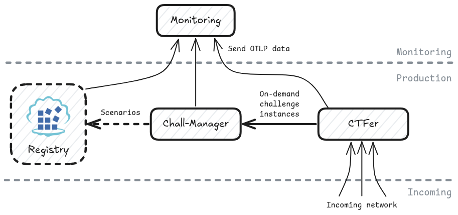

<div align="center">
  <h1>Fullchain</h1>
  <a href="https://pkg.go.dev/github.com/ctfer-io/fullchain"></a>
  <a href="https://goreportcard.com/report/github.com/ctfer-io/fullchain"></a>
  <a href="https://coveralls.io/github/ctfer-io/fullchain?branch=main"></a>
  <br>
  <a href=""></a>
  <a href="https://github.com/ctfer-io/fullchain/actions?query=workflow%3Aci+"></a>
  <a href="https://github.com/ctfer-io/fullchain/actions/workflows/codeql-analysis.yaml"></a>
  <br>
  <a href="https://securityscorecards.dev/viewer/?uri=github.com/ctfer-io/fullchain"></a>
</div>

The _Fullchain_ is an umbrella project that sacrifices the [independent deployability](https://microservices.io/post/architecture/2022/05/04/microservice-architecture-essentials-deployability.html) of CTFer.io's stack in favor of a ready-to-use CTF (Capture The Flag) platform.

Its purpose is to help deploy production-like environment that the community might end up deploying themselves, for test purposes, demonstrations, or SaaS work on sponsored events.

It notably contains [CTFd](https://github.com/ctfd/ctfd) through our [re-packaged image](https://github.com/ctfer-io/ctfd-packaged), [Chall-Manager](https://github.com/ctfer-io/chall-manager) and [its CTFd plugin](https://github.com/ctfer-io/ctfd-chall-manager) already configured, along with the [Monitoring](https://github.com/ctfer-io/monitoring) stack. This list is expected to grow through time, as more services become mature enough for CTF infrastructures.

<div align="center">
  
</div>

> [!CAUTION]
>
> This component is an **internal** work mostly used for development purposes.
> It is used for production purposes too, i.e. on Capture The Flag events.
>
> Nonetheless, **we do not include it in the repositories we are actively maintaining**, and is subject to future major changes with no migration capability.

## 📦 Deployment

### Configuration

The default configuration will work, but you might not end up with a ✨ _perfect_ 🤌 setup.

To do so, you can look at the whole [`Pulumi.yaml`](Pulumi.yaml) configuration.
We detail some of them here.

#### Dedicated Challenges Cluster

If you want to configure a dedicated cluster for challenges.

```bash
# export PULUMI_CONFIG_PASSPHRASE before
# https://github.com/pulumi/pulumi/issues/6015
cat /path/to/kubeconfig | pulumi config set --secret --path chall-manager.kubeconfig
```

#### Custom Certificate

If you want to use a custom certificate.
We **HIGHLY** recommend it for production purposes, especially to avoid MitM attacks, credentials leakage and so on.

```bash
# export PULUMI_CONFIG_PASSPHRASE before
# https://github.com/pulumi/pulumi/issues/6015
cat /path/to/crt.pem | pulumi config set --secret --path ctfer.platform.crt
cat /path/to/key.pem | pulumi config set --secret --path ctfer.platform.key
```

#### DNS Ingress hostname

If you want to expose your CTF platform to external people, through a DNS name.

```bash
pulumi config set --path ctfer.platform.hostname ctfd.yourdomain
```

#### Workers and Replicas

If you want to configure several workers on CTFd.

```bash
pulumi config set-all \
  --path ctfer.platform.workers 3 \
  --path ctfer.platform.replicas 3
```

> [!WARNING]
> You will need a ReadWriteMany compatible CSI (e.g., Longhorn) if the Pods are scheduled on several nodes
> ```bash
> pulumi config set-all \
>   --path ctfer.platform.pvc-access-modes[0] ReadWriteMany \
>   --path ctfer.platform.storage-class longhorn
> ```

### Air-gap environments

If you don't need air-gap settings, you can **directly skip to [the deployment](#lets-do-it)**.

For air-gap environments, you need to download all images and upload them into your registry before deployment. You can use [Hauler](https://docs.hauler.dev/) to download and push all images at once.

The following actions must be performed before the `pulumi up -y`.

1. Navigate to the `hack` directory:
    ```bash
    cd hack
    ```

2. Synchronize images with Hauler:
    ```bash
    hauler store sync -f chaine-totale.yml
    ```

3. Copy images to your registry:
    ```bash
    hauler store copy registry://your-registry:5000
    ```

4. Configure the Registry to use on your stack:
    ```bash
    pulumi config set registry your-registry:5000
    ```

### Let's do it!

Now the last-mile for infrastructure-specific configuration, and you should be good to deploy CTFer! 💪

```bash
pulumi config set-all \
  --path platform.hostname ctfd.dev1.ctfer-io.lab \
  --path ingress-labels.name traefik \
  --path db.operator-namespace cnpg-system

pulumi up
```

## 🏗️ Known limitations

Due to the maturity of the Fullchain some configurations are not yet easily customizable.

To use this project correctly, we recommend you:
- install the CNPG operator in the `cnpg-system` namespace ;
- install the Ingress Controller in the `ingress-controller` namespace ;
- install Cilium as the CNI (and enable Hubble for debugging, perhaps is not necessary for production) ;
- use a CTFd image with `psycopg2-binary` package, for instance [our repackaged image](https://github.com/ctfe-io/ctfd-packaged) (or create yours with `ctferio/ctfd`).
